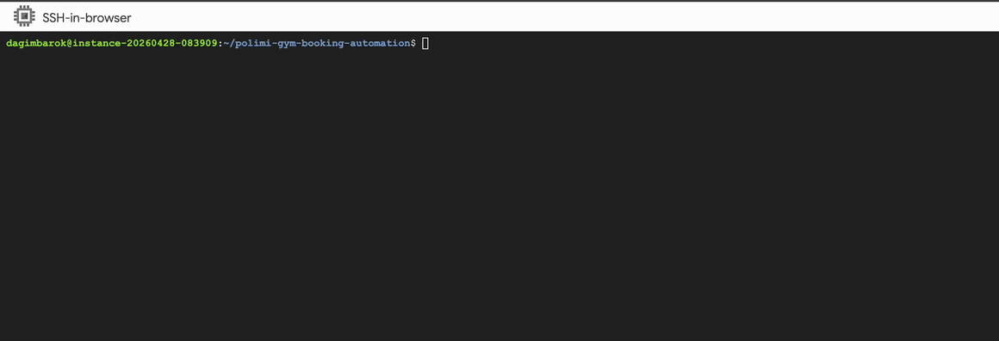

# Polimi Gym Booking Automation

An automated tool that books gym time slots at Polimi's Giurati Fit Center by simulating human-like interactions through web automation.

## Table of Contents

- [Overview](#overview)
- [Demo](#demo)
- [Project Structure](#project-structure)
- [Features](#features)
- [Setup](#setup)
  - [Normal Mode (visible browser)](#normal-mode-visible-browser)
  - [Headless Mode (no visible browser)](#headless-mode-no-visible-browser)
- [Configuration](#configuration)
  - [Environment Variables](#environment-variables)
  - [Gmail Setup](#gmail-setup)
- [Usage](#usage)
- [Logging](#logging)
- [Dependencies](#dependencies)
- [Docker](#docker)
- [Deployment](#deployment)
  - [GitHub Actions (recommended)](#github-actions-recommended)
  - [Cloud VM](#cloud-vm)
  - [Local Machine](#local-machine)
- [Future Enhancements](#future-enhancements)

## Overview

This project uses [selenium](https://www.selenium.dev/) to automate the gym booking process for polimi's giurati gym. It logs into the gym booking portal, navigates through the booking flow, handles two-factor authentication via OTP, and automatically books a time slot at the gym two days in advance.

The tool mimics human behavior by:
- Adding random delays between actions
- Typing text with human-like keystroke delays

Upon successful booking, it sends a screenshot confirmation email. If an error occurs, it sends an error report email.

## Demo

A scheduled run on a headless cloud instance from launch through login, 2FA, slot selection and confirmation, to the screenshot email going out. Shown at 2x speed; the real run takes about a minute.



## Project Structure

```
polimi-gym-booking-automation/
├── README.md               
├── requirements.txt         
├── Dockerfile               
├── docker-compose.yml      
├── .env.example             # Template for the required environment variables
├── .gitignore
├── .github/
│   └── workflows/
│       └── book.yml         
├── assets/
│   └── headless-run.gif     
├── logs/                    # Host-mounted log directory (git-ignored)
│   └── booking_automation.log
└── src/
    ├── main.py              # Entry point
    ├── config/              
    │   ├── __init__.py      
    │   ├── booking.py       
    │   ├── constants.py     
    │   └── themes.py        # Text theme configurations for messages
    ├── pages/               
    │   ├── __init__.py
    │   └── pages.py         # Page object implementations
    └── utils/               # Utility modules
        ├── __init__.py
        ├── logger.py        # Logging functionality
        ├── reporter.py      # Reporting and email functionality
        └── decorators/      # Custom decorators
            ├── __init__.py
            └── log_call.py  # Call logging decorator
```

## Setup

The bot runs in one of two modes, chosen by the `ENV` variable. They have different prerequisites, so pick one and follow only that section.

|                        | Normal mode (`ENV=dev`)                 | Headless mode (`ENV=prod`)                      |
| ---------------------- | --------------------------------------- | ----------------------------------------------- |
| Browser                | Chrome on your machine, window visible   | Chromium inside a Selenium container            |
| Runs on                | Your machine           | Docker Compose                                  |
| After the run          | Window stays open for inspection         | Containers exit                                 |
| Requirements     | Python + Chrome                          | Docker only                                     |

Both modes read the same `.env` (see [Configuration](#configuration)) and both need Polimi credentials and a Gmail app password.

### Normal Mode (visible browser)

**Prerequisites**

- Python 3.12 or higher
- Google Chrome installed

You do not need to install ChromeDriver — Selenium Manager downloads a matching one on first run.

**Installation**

1. Clone the repository:
```bash
git clone https://www.github.com/barokdg/polimi-gym-booking-automation
cd polimi-gym-booking-automation
```

2. Create a virtual environment:
```bash
python3 -m venv .venv
source .venv/bin/activate  # On Windows: .venv\Scripts\activate
```

3. Install dependencies:
```bash
pip install -r requirements.txt
```

4. Create your `.env` (see [Configuration](#configuration)) and set:
```
ENV=dev
```

5. Run it:
```bash
python src/main.py
```

Chrome opens and you can watch the whole flow. The window is left open when the script finishes, so you can inspect the final page.

### Headless Mode (no visible browser)

**Prerequisites**

- Docker with Compose

**Installation**

1. Clone the repository:
```bash
git clone https://www.github.com/barokdg/polimi-gym-booking-automation
cd polimi-gym-booking-automation
```

2. Create your `.env` (see [Configuration](#configuration)). Compose reads it to fill in the credentials, and forces `ENV=prod` for the bot itself, so the `ENV` value in your file only affects normal-mode runs.

3. Build and run:
```bash
docker compose up 
```

Compose starts two containers: `selenium`, a Selenium Grid with headless Chrome, and `bot`, which waits for the grid to pass its health check and then drives it over the Compose network at `http://selenium:4444`. The bot exits once the booking is done; the grid stays up, so stop it with `docker compose down`.

Because that hostname only resolves inside the Compose network, `ENV=prod` won't work with a plain `python src/main.py` — the bot has no browser of its own to fall back on. Run headless through Compose, or point a Selenium server at `selenium:4444` yourself.

## Configuration

### Environment Variables

Create a `.env` file in the project root (use `.env.example` as a template):

```
USERNAME=your_polimi_username
PASSWORD=your_polimi_password
TOKEN=your_totp_secret_key
DESTINATION_EMAIL_ADDRESS=recipient@example.com
SMTP_EMAIL_ADDRESS=your_gmail@gmail.com
SMTP_PASSWORD=your_gmail_app_password
ENV=prod  # 'dev' or 'prod'
```

#### Variable Details

- **USERNAME**: Your Polimi account username
- **PASSWORD**: Your Polimi account password
- **TOKEN**: The secret key for TOTP (Time-based One-Time Password) - obtain from your Polimi 2FA settings
- **DESTINATION_EMAIL_ADDRESS**: Email address where booking confirmations/errors will be sent
- **SMTP_EMAIL_ADDRESS**: Gmail account used to send emails
- **SMTP_PASSWORD**: Gmail app-specific password (not your regular password)
- **ENV**: 
  - `dev`: Browser window stays open after execution for debugging
  - `prod`: Runs in headless mode (no visible browser window)

### Gmail Setup

To send emails via Gmail:
1. Enable 2FA on your Google Account
2. Generate an [App Password](https://support.google.com/accounts/answer/185833)
3. Use the app password in the `SMTP_PASSWORD` variable

## Usage

Start a run from the project root, with the command for your mode:

```bash
python src/main.py    # normal mode
```

```bash
docker compose up     # headless mode
```

Either way, the script will:
1. Check if today is a valid booking day (Monday-Friday in my case, adjusted for 2-day advance booking)
2. Initialize a Chrome WebDriver — local in normal mode, remote against the Selenium container in headless mode
3. Log into SportRick platform
4. Authenticate with Polimi credentials
5. Enter OTP for 2FA verification
6. Navigate to bookings and select Giurati Fit Center
7. Book the latest available time slot for two days in advance
8. Send a confirmation email with a screenshot
9. Clean up and close the browser

## Logging

Log messages are printed to stdout during execution and automatically written to `booking_automation.log`. 


## Dependencies

See [requirements.txt](requirements.txt) for the complete list. Key dependencies:

- **selenium**: Web automation framework; its bundled Selenium Manager also resolves ChromeDriver in normal mode
- **python-dotenv**: Loads environment variables from .env
- **pyotp**: Generates TOTP codes for 2FA

## Docker

Running in Docker means you don't have to install a browser, Python, or a matching ChromeDriver on the host. The work is split across two containers, defined in `docker-compose.yml`:

- **`selenium`** — the official `selenium/standalone-chrome` image, which bundles headless Chrome and its matching driver behind a Selenium Grid endpoint on port 4444. It has a health check, and the bot won't start until it passes.
- **`bot`** — built from the `Dockerfile`, a plain `python:3.12-slim` with just the project's dependencies and `src/`. It carries no browser of its own; it drives the grid remotely at `http://selenium:4444`.

The booking date doesn't depend on either container's clock — `Day.today()` computes it against `Europe/Rome` in code (`src/config/constants.py`), so the containers can run on a UTC host without drifting.

### Build

```bash
docker compose build
```

### Run

Create a `.env` first (see [Environment Variables](#environment-variables)). Compose sets `ENV=prod` for the bot.

```bash
docker compose up
```

The bot performs a booking run and exits; the grid stays up until you run `docker compose down`.

Logs go to stdout (`docker logs`) and to `booking_automation.log` inside the bot container, which disappears with it. To keep them on the host, mount a directory and point `LOG_FILE` at it:

```yaml
  bot:
    environment:
      LOG_FILE: /app/logs/booking_automation.log
    volumes:
      - ./logs:/app/logs
```

## Deployment

### GitHub Actions (recommended)

Nothing to host and nothing to keep powered on. The workflow in `.github/workflows/book.yml` does the whole job: it checks the repo out, builds the images, and runs the containers.

1. Fork the repository. (If you'd rather keep your copy private, clone it and push to a new private repo instead — a fork of a public repo can't be made private.)
2. Open the **Actions** tab and enable workflows. Forks start with them disabled, so the schedule never fires until you do this.
3. Under **Settings → Environments**, create an environment named `prod` — the job declares `environment: prod`.
4. Add your credentials there as secrets: `USERNAME`, `PASSWORD`, `TOKEN`, `DESTINATION_EMAIL_ADDRESS`, `SMTP_EMAIL_ADDRESS`, `SMTP_PASSWORD`. There's no `ENV` secret — Compose sets it for the bot. Secrets are never copied from the upstream repo, and yours stay invisible to it.
5. Go to **Actions → Booking → Run workflow** to trigger a run by hand and confirm the setup works end to end. After that the schedule takes over, and you get the same confirmation email as always.

Two things worth knowing about scheduled workflows:

- **Runs can start late.** Scheduled jobs queue alongside everyone else's and are frequently delayed, occasionally by a lot.
- **They pause after 60 days of repo inactivity.** Any push, or a manual run, re-enables the schedule.

### Cloud VM

Worth it if you'd rather not depend on GitHub's queue. A VM has no display, so it runs [headless mode](#headless-mode-no-visible-browser) and needs only Docker. These steps are for GCP Compute Engine; EC2 and Azure VMs work the same way.

1. Create a VM instance with Ubuntu 26.04 LTS (Minimal), or another distro of your choice.
2. Connect via SSH and install what's needed:

```bash
sudo apt update && sudo apt upgrade -y
sudo apt install -y git cron vim

# Docker with the Compose plugin
curl -fsSL https://get.docker.com | sudo sh

# Run docker without sudo (log out and back in afterwards)
sudo usermod -aG docker "$USER"
```

3. Set the machine's timezone, so cron fires at the hour you expect — instances usually default to UTC:

```bash
sudo timedatectl set-timezone Europe/Rome
```

4. Clone the repository and write your `.env`:

```bash
git clone https://www.github.com/barokdg/polimi-gym-booking-automation.git
cd polimi-gym-booking-automation
vim .env
```

5. Confirm a run works before scheduling it:

```bash
docker compose up --abort-on-container-exit --exit-code-from bot
```

6. Add it to `crontab -e`, here at 08:00 daily:

```
0 8 * * * cd /home/username/polimi-gym-booking-automation && /usr/bin/docker compose up --abort-on-container-exit --exit-code-from bot >> /var/log/gym-booking-cron.log 2>&1
```

### Local Machine

Same as the VM setup, minus the provider: install Docker, then schedule `docker compose up --abort-on-container-exit --exit-code-from bot` with cron on macOS/Linux or Task Scheduler on Windows.

**⚠️ Your computer must be awake at that time** for the job to fire, which is the main reason to prefer one of the options above. If you have a workaround, please [create an issue](../../issues) or [submit a PR](../../pulls).

## Future Enhancements

- Implement fallback logic to book alternative time slots if preferred slot is unavailable
- Connect with a telegram bot to manage bookings and receive notifications
